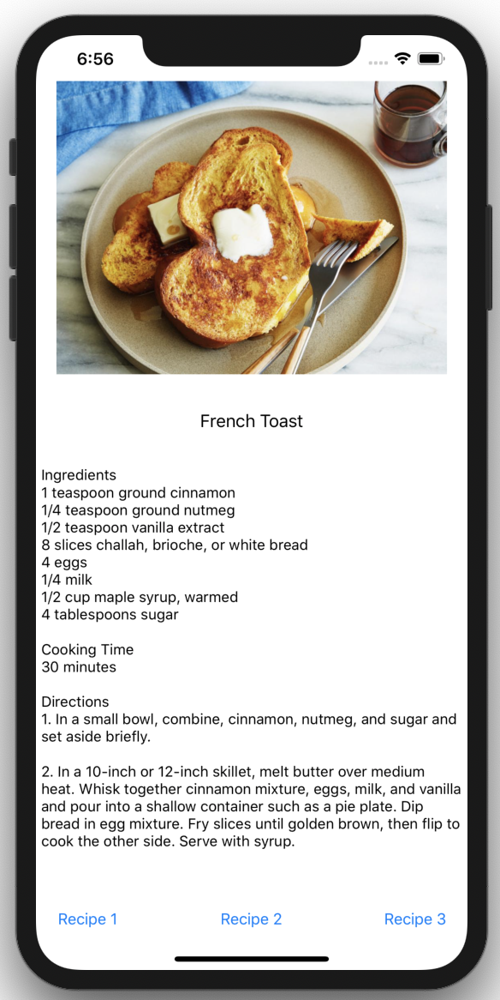

# Recipes-Intro-To-MVC-Architecture

In class example of using the MVC (model-view-controller) architecture. In this lesson we created a recipes app. The model is a Recipe struct, we have one view in our application pictured below and a single view controller class that manages the view and the model data. 

## Model 

We use a struct named Recipe to encapsulate our recipe data for our app. 

<details>
  <summary>Recipe is our model data</summary>

```swift 
struct Recipe {
  // properties
  let name: String
  let numberOfServings: Int
  let ingredients: [String: String]
  let duration: Int // cooking time
  let equipment: [String]
  let temperature: Double
  let servingProcedure: String
  let review: Bool
  let image: UIImage
  let nutritionalValue: String
  let directions: [String]
  
  var recipeDescription: String {
    var description = "Ingredients\n"
    for (ingredient, quantity) in ingredients {
      if quantity.isEmpty {
        description += ingredient + "\n"
      } else {
        description += quantity + " " + ingredient + "\n"
      }
    }
    
    let cookingTime = "\nCooking Time\n"
    description += cookingTime
    description += duration.description + " minutes\n"

    let directions = "\nDirections\n"
    description += directions
    for (index, direction) in self.directions.enumerated() {
      description += "\(index + 1). " + direction + "\n\n"
    }
    return description
  }
  
  // type method, Recipe.getRecipes()
  static func getRecipes() -> [Recipe] {
    var recipes = [Recipe]()
    let deviledEggsRecipe = Recipe.init(name: "Classic Deviled Eggs", numberOfServings: 4,
                                        ingredients: ["eggs": "6",
                                                      "mayonnaise" : "1/4 cup"],
                                        duration: 35,
                                        equipment: ["saucepan"], temperature: 100, servingProcedure: "",
                                        review: true, image: UIImage.init(named: "classic-deviled-eggs")!,
                                        nutritionalValue: "",
                                        directions: ["Place eggs in a single layer in a saucepan and cover with enough water that there's 1 1/2 inches of water above the eggs. Heat on high until water begins to boil, then cover, turn the heat to low, and cook for 1 minute. Remove from heat and leave covered for 14 minutes, then rinse under cold water continuously for 1 minute.",
                                                     "Crack egg shells and carefully peel under cool running water. Gently dry with paper towels. Slice the eggs in half lengthwise, removing yolks to a medium bowl, and placing the whites on a serving platter. Mash the yolks into a fine crumble using a fork. Add mayonnaise, vinegar, mustard, salt, and pepper, and mix well.",
                                                     "Evenly disperse heaping teaspoons of the yolk mixture into the egg whites. Sprinkle with paprika and serve."])
    let perfectRoastChicken = Recipe.init(name: "Perfect Roast Chicken", numberOfServings: 8,
                                          ingredients: ["roasting chicken" : "5 or 6lbs",
                                                        "lemon" : "1",
                                                        "Freshly ground black pepper": "",
                                                        "large bunch fresh thyme" : "1",
                                                        "head garlic" : "1",
                                                        "tablespoons butter" : "2",
                                                        "carrots" : "4",
                                                        "fennel" : "1 bulb",
                                                        "Olive Oil" : ""
      ],
                                          duration: 130,
                                          equipment: ["roasting pan"], temperature: 100, servingProcedure: "",
                                          review: true, image: UIImage.init(named: "perfect-roast-chicken")!,
                                          nutritionalValue: "",
                                          directions: ["Preheat the oven to 425 degrees F",
                                                       "Remove the chicken giblets. Rinse the chicken inside and out. Remove any excess fat and leftover pin feathers and pat the outside dry. Liberally salt and pepper the inside of the chicken. Stuff the cavity with the bunch of thyme, both halves of lemon, and all the garlic. Brush the outside of the chicken with the butter and sprinkle again with salt and pepper. Tie the legs together with kitchen string and tuck the wing tips under the body of the chicken. Place the onions, carrots, and fennel in a roasting pan. Toss with salt, pepper, 20 sprigs of thyme, and olive oil. Spread around the bottom of the roasting pan and place the chicken on top.",
                                                       "Roast the chicken for 1 1/2 hours, or until the juices run clear when you cut between a leg and thigh. Remove the chicken and vegetables to a platter and cover with aluminum foil for about 20 minutes. Slice the chicken onto a platter and serve it with the vegetables."])
    
    let frenchToast = Recipe.init(name: "French Toast", numberOfServings: 4,
                                  ingredients: ["teaspoon ground cinnamon" : "1",
                                                "teaspoon ground nutmeg" : "1/4",
                                                "tablespoons sugar": "4",
                                                "eggs" : "4",
                                                "milk" : "1/4",
                                                "teaspoon vanilla extract" : "1/2",
                                                "slices challah, brioche, or white bread" : "8",
                                                "cup maple syrup, warmed" : "1/2"
      ],
                                  duration: 30,
                                  equipment: ["bowl","skillet"], temperature: 100, servingProcedure: "",
                                  review: true, image: UIImage.init(named: "french-toast")!,
                                  nutritionalValue: "",
                                  directions: ["In a small bowl, combine, cinnamon, nutmeg, and sugar and set aside briefly.",
                                               "In a 10-inch or 12-inch skillet, melt butter over medium heat. Whisk together cinnamon mixture, eggs, milk, and vanilla and pour into a shallow container such as a pie plate. Dip bread in egg mixture. Fry slices until golden brown, then flip to cook the other side. Serve with syrup."])
    
    recipes = [deviledEggsRecipe, perfectRoastChicken, frenchToast]
    return recipes
  }
}
```

</details> 

## View

The one and only view in this MVC demo application.

    

## Controller 

<details>
  <summary>The controller manages user interactions between the View and data flow to and from the Model</summary> 
  
```swift
class ViewController: UIViewController {
  
  // outlets
  @IBOutlet weak var recipeImage: UIImageView!
  @IBOutlet weak var recipeName: UILabel!
  @IBOutlet weak var recipeDescription: UITextView!
  
  // recipe data
  let recipes = Recipe.getRecipes()
  
  override func viewDidLoad() {
    super.viewDidLoad()
    updateRecipeAtIndex(index: 0)
  }
  
  @IBAction func recipeChanged(_ recipeButton: UIButton) {
    updateRecipeAtIndex(index: recipeButton.tag)
  }
  
  func updateRecipeAtIndex(index: Int) {
    // recipe button tags will be 0, 1 and 2
    let recipe = recipes[index] // value of index e. 0, 1, 2
    
    // udpate UI elements using the currenr Recipe instance above
    recipeImage.image = recipe.image
    recipeName.text = recipe.name
    recipeDescription.text = recipe.recipeDescription    
  }
}
```
</detials> 
